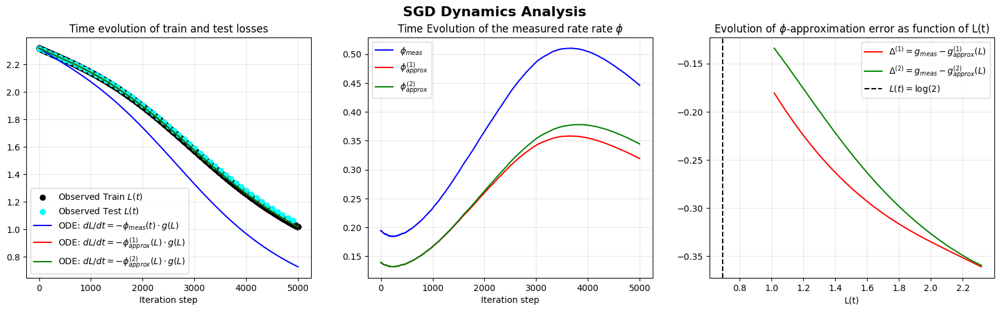
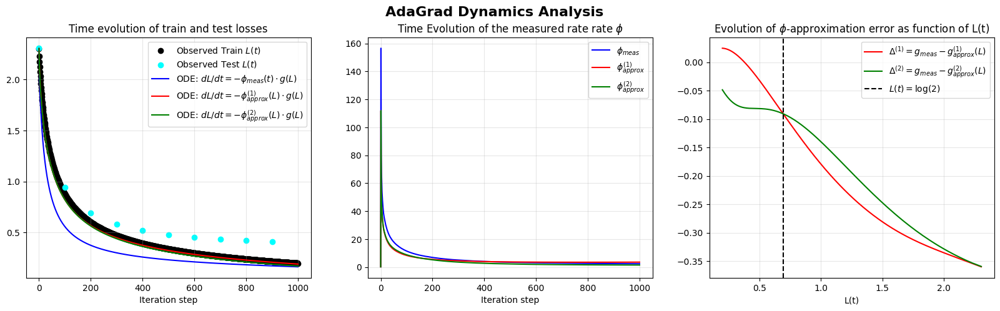
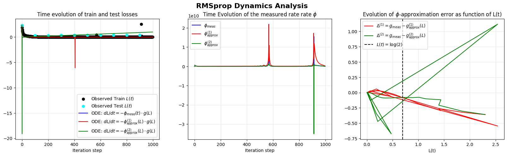

# [Research] State Rate ODE for Loss Dynamics

[[NeuRIPS submission 2025]](https://openreview.net/forum?id=QJtanJS4T9&referrer=%5Bthe%20profile%20of%20Williams%20Zanga%5D(%2Fprofile%3Fid%3D~Williams_Zanga1))
[[Colab notebook]](https://drive.google.com/file/d/1L0TcJK8bXg5FBA9gU6PkUkgHXjoZg-wo/view?usp=sharing)


This repository provides an (in-developement and experimental) implementation of the Loss state rate factorized ODE $\dot L(t) \;=\; -\,\phi(t)\,g(L(t), \sigma_{L})$ for neural network training loss dynamics under gradient flow. That factorization separates loss-specific topology scalar that depends on the instantaneous loss and batch statistics from  time-varying (to be refined) effective rate that aggregates data, architecture and optimizer effects. 

<p align="center">
  
</p>


Datasets used during development:
- [MNIST](https://en.wikipedia.org/wiki/MNIST_database): early stage developement
- [CIFAR10](https://www.cs.toronto.edu/~kriz/cifar.html): second stage developement
- [AGNews](https://huggingface.co/datasets/sh0416/ag_news)


## Getting started with a quick experiment (MNIST + SGD ODE)
See Colab notebook: https://drive.google.com/file/d/1L0TcJK8bXg5FBA9gU6PkUkgHXjoZg-wo/view?usp=sharing

<p align="center">
  
</p>

<p align="center">
  
</p>


## References Papers and Related Topics
- [1] Sanjeev Arora, Nadav Cohen, Noah Golowich, and Wei Hu. A convergence analysis of gradient descent for deep linear neural networks, 2019. URL https://arxiv.org/abs/1810.02281.
- [2] Arzu Ahmadova. Convergence results for gradient flow and gradient descent systems in the artificial neural network training, 2023. URL https://arxiv.org/abs/2306.13086.
- [3] Patrick Cheridito, Arnulf Jentzen, Adrian Riekert, and Florian Rossmannek. A proof of convergence for gradient descent in the training of artificial neural networks for constant target functions. Journal of Complexity, 72:101646, October 2022. doi: 10.1016/j.jco.2022.101646. URL http://dx.doi.org/10.1016/j.jco.2022.101646.
- [4] Spencer Frei and Quanquan Gu. Proxy convexity: A unified framework for the analysis of neural networks trained by gradient descent, 2022. URL https://arxiv.org/abs/2106.13792.
- [5] Hamed Karimi, Julie Nutini, and Mark Schmidt. Linear convergence of gradient and proximal-gradient methods under the polyak-łojasiewicz condition, 2020. URL https://arxiv.org/abs/1608.04636.
- [6] Kairong Luo, Haodong Wen, Shengding Hu, Zhenbo Sun, Zhiyuan Liu, Maosong Sun, Kaifeng Lyu, and Wenguang Chen. A multi-power law for loss curve prediction across learning rate schedules, 2025. URL https://arxiv.org/abs/2503.12811.
- [7] Alexander Maloney, Daniel A. Roberts, and James Sully. A solvable model of neural scaling laws, 2022. URL https://arxiv.org/abs/2210.16859.
- [8] Jared Kaplan, Sam McCandlish, Tom Henighan, Tom B. Brown, Benjamin Chess, Rewon Child, Scott Gray, Alec Radford, Jeffrey Wu, and Dario Amodei. Scaling laws for neural language models, 2020. URL https://arxiv.org/abs/2001.08361.
- [9] Clément L. Canonne. A short note on an inequality between kl and tv, 2023. URL https://arxiv.org/abs/2202.07198.
- [10] Rajendra Bhatia and Chandler Davis. A better bound on the variance. The American Mathematical Monthly, 107(4):353–357, 2000. doi: 10.1080/00029890.2000.12005203. URL https://doi.org/10.1080/00029890.2000.12005203.
- [11] Diederik P. Kingma and Max Welling. Auto-encoding variational bayes, 2013. URL https://arxiv.org/abs/1312.6114.
- [12] Aaron van den Oord, Oriol Vinyals, and Koray Kavukcuoglu. Neural discrete representation learning, 2018. URL https://arxiv.org/abs/1711.00937.
- [13] Yann LeCun and Corinna Cortes. MNIST handwritten digit database. 2010. URL http://yann.lecun.com/exdb/mnist/.


## Citing this paper
````
@misc{wkzng2025iredfloor,
  title={Irreducible Loss Floors in Gradient-Based Optimization and Energy Footprint},
  author  = {Anonymous Author},
  year    = {2025},
  eprint  = {arXiv:2506.xxxxx},
  archivePrefix = {arXiv},
  primaryClass  = {cs.LG},
  note    = {Under review at NeurIPS 2025}
}
````