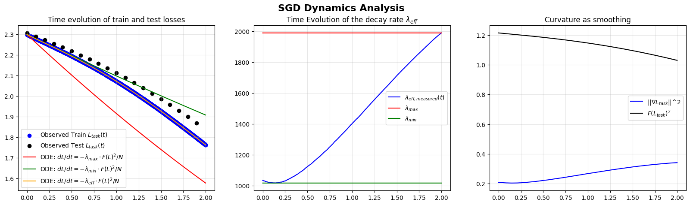

# Irreducible Loss Floors in Gradient-Based Optimization and Energy Footprint

This repository provides the official code and reproducible experiments accompanying the paper **"Irreducible Loss Floors in Gradient-Based Optimization and Energy Footprint"**. It implements the numerical estimation of lower bounds on the training loss under idealized convergence assumptions, and illustrates the framework's behavior across various learning problems.


## Experiment 1: Validity of the Gradient Flow simplified ODE on MNIST

Goal: Verify the validity of the SGD ODE
Result: `experiments/experiment_GD_wideMLP_2000.csv`

````
# Load MNIST dataset
transform = transforms.Compose([transforms.ToTensor()])
train_dataset = torchvision.datasets.MNIST(root='./data', train=True, download=True, transform=transform)
train_batch_size = len(train_dataset) // 10
train_dataset = torch.utils.data.Subset(train_dataset, range(0, train_batch_size)) # Use first `eval_batch_size` samples
train_loader = torch.utils.data.DataLoader(train_dataset, batch_size=train_batch_size, shuffle=False, pin_memory=True, num_workers=1)

# For full dataset evaluation (smaller subset for efficiency)
test_batch_size = min(1000, train_batch_size)
test_dataset = torchvision.datasets.MNIST(root='./data', train=False, download=True, transform=transform)
test_dataset = torch.utils.data.Subset(test_dataset, range(0, test_batch_size)) # Use first `eval_batch_size` samples
test_loader = torch.utils.data.DataLoader(test_dataset, batch_size=test_batch_size, shuffle=False, pin_memory=True)

max_steps = 1000 * 2
architecture ="wideMLP" # "WideMLP"
model_args = {"depth":3}

model_creator = ModelCreator(architecture, model_args=model_args)
model_creator.create()
task_loss_fn = CrossEntropyLossWrapper()
initial_learning_rate = 1e-3
weight_decay = initial_learning_rate/10

experiment = SGDExperiment(
    model_creator=model_creator,
    train_loader=train_loader,
    test_loader=test_loader,
    learning_rate=initial_learning_rate,
    weight_decay=weight_decay,
    task_loss_fn=task_loss_fn,
    max_steps=max_steps
)

df:pd.DataFrame = experiment.run()
````



Observation: The solution of the ODE computed with the measured rate of decay match with the exact losses observed on the train set.


## Citing

````
@misc{wkzng2025iredfloor,
  title={Irreducible Loss Floors in Gradient-Based Optimization and Energy Footprint},
  author  = {Anonymous Author},
  year    = {2025},
  eprint  = {arXiv:2506.xxxxx},
  archivePrefix = {arXiv},
  primaryClass  = {cs.LG},
  note    = {Under review at NeurIPS 2025}
}
````